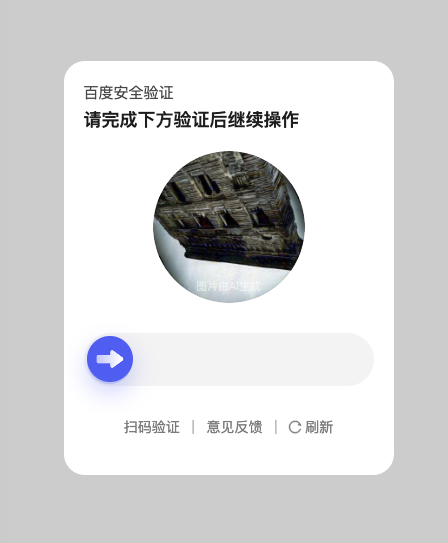
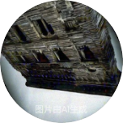
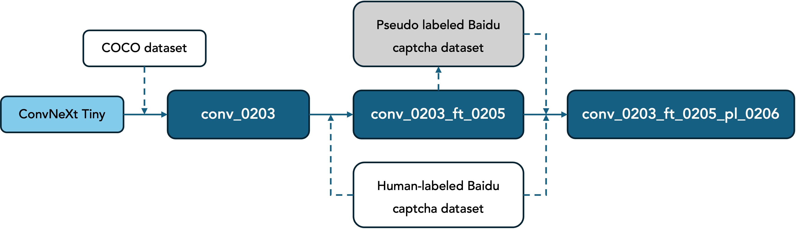

# 旋转图片角度识别 rotate-captcha-solver

## 1 项目简介

本项目旨在解决单图片旋转验证码的角度识别问题，核心思想是使用深度学习模型预测验证码的旋转角度，从而实现自动化处理。项目以百度验证码为例，采用ConvNeXt Tiny作为基础模型，通过回归任务预测旋转角度，并结合微调以及伪标签半监督学习，从而提升模型性能。

<div align="center">
  
</div>

百度验证码图片：大小为152px * 152px，白色底，内切圆为需旋转图片。

<div align="center">
  
</div>

## 2 方法概述

<div align="center">
  
</div>

### 2.1 预数据处理

- 采用[COCO数据集](https://www.kaggle.com/datasets/awsaf49/coco-2017-dataset/data)作为基础，对20000张原始训练图片，每张施加5个随机角度旋转，构造训练集。
- 使用回归任务（直接预测角度）训练模型。

### 2.2 模型架构

- 采用ConvNeXt Tiny作为主干网络，加载预训练权重。
- 修改分类头classifier，以适应旋转角度预测。
- 考虑到角度的周期性问题（0度等同于360度），模型输出sin和cos作为输出结果。

### 2.3 损失函数

项目使用CyclicMSELoss作为损失函数，结合MSE Loss和Cosine Similarity Loss，以更好地适应旋转角度预测任务。

### 2.4 模型微调

在COCO预训练基础上，使用人工标注的200张百度验证码图片进一步微调，使模型更好地适应旋转验证码的图片特征。

### 2.5 半监督学习

- 利用微调好的模型，对无标注的验证码图片进行推理，并选取置信度高的样本作为伪标签数据。
- 混合真实标签和伪标签进行再训练，提高模型的泛化能力。

## 3 模型表现

|          **模型名称**         | **MAE（COCO图片测试集）** | **MAE（百度验证码图片测试集）** | **真实通过率** |
|:-----------------------------:|:-------------------------:|:-------------------------------:|:--------------:|
|           conv_0203           |         **13.49°**        |              27.52°             |     61.67%     |
|       conv_0203_ft_0205       |           15.55°          |              5.83°              |     71.53%     |
| **conv_0203_ft_0205_pl_0206** |           15.80°          |            **5.56°**            |   **73.33%**   |

- COCO图片测试集：包含10000张随机旋转图片。原始图像10000张（每张图片随机1个角度），来自COCO测试集。
- 百度验证码图片测试集：包含200张随机旋转的验证码图片。原始图像20张（每张图片随机10个角度），来自人工标注的验证码图片。
- 真实通过率：基于1500次真实测试结果统计而来。

## 4 运行环境

参考`requirements.txt`。

## 5 安装与使用

### 5.1 克隆项目及安装依赖

```bash
# 克隆项目
git clone https://github.com/your-repo/rotate-captcha-solver.git
cd rotate-captcha-solver

# 安装依赖
pip install -r requirements.txt
```

### 5.2下载模型

- 链接: https://pan.baidu.com/s/1JGpzwujGRE2fE7tIiAWntw?pwd=7jf2 提取码: 7jf2
- 下载后放入根目录`models`文件夹

### 5.3 推理

参考`inference.py`。

### 5.4 训练
- 训练：
  1. 将原始训练图片数据，分为train、test、val放三个不同文件夹。
  2. 修改对应路径和参数，运行`generate_imgs.py`，随机旋转原始图片来增强数据。
  3. 修改对应路径和参数，运行`train.py`。
- 微调：
  1. 手动标注图片，即修改图片名称。命名规范：比如将图片`example.png`（顺时针）旋转39.99度，需改名为`example_rot39_99_0.png`（末尾0是ID，可以为任意数字，本身作用是区别同一张原始图片的多个处理后图片）。
  2. 修改对应路径和参数，运行`restore_imgs.py`，还原标注图片。
  3. 修改对应路径和参数，运行`generate_imgs.py`，随机旋转原始图片来增强数据。
  4. 修改对应路径和参数，运行`finetune.py`。
- 伪标签半监督学习：
  1. 修改对应路径和参数，运行`restore_pseudo.py`，用模型预测并还未标注图片。
  2. 修改对应路径和参数，运行`generate_imgs.py`，随机旋转原始图片来增强数据。
  3. 修改对应路径和参数，运行`finetune.py`。

### 5.5 评估

参考`evaluate.py`。

### 5.6 真实环境测试

参考`real_test.py`。

## 6 代码结构说明

```bash
# 项目结构
rotate-captcha-solver
├── caps                     # 百度验证码图片数据
│   ├── raw_labeled_caps     # 人工标注的百度验证码图片
│   ├── unlabeled_caps       # 未标注的百度验证码图片
├── imgs                     # COCO图片数据
│   ├── test                 # COCO测试集
│   ├── train                # COCO训练集
│   └── val                  # COCO验证集
├── models                   # 训练好的模型
├── readme_imgs              # README说明图片
├── utils                    # 工具函数
│   ├── crawler_utils.py     # 爬虫网页相关工具
│   ├── image_utils.py       # 图像处理相关工具
│   └── model_utils.py       # 模型相关工具（可以修改模型结构、mask等）
├── download_caps.py         # 下载验证码图片
├── evaluate.py              # 评估
├── finetune.py              # 微调
├── generate_imgs.py         # 生成图像数据
├── inference.py             # 推理
├── real_test.py             # 真实测试
├── restore_imgs.py          # 还原图像角度
├── restore_pseudo.py        # 生成并还原伪标注图像
└── train.py                 # 训练
```